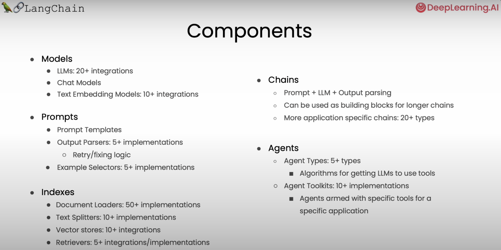

# LangChain for LLM Application Development

Prerequisite recommendation: Basic Python

The framework to take LLMs out of the box. Learn to use LangChain to call LLMs into new environments, and use memories, chains, and agents to take on new and complex tasks.

- Apply LLMs to proprietary data to build personal assistants and specialized chatbots
- Use agents, chained calls, and memories to expand your use of LLMs

