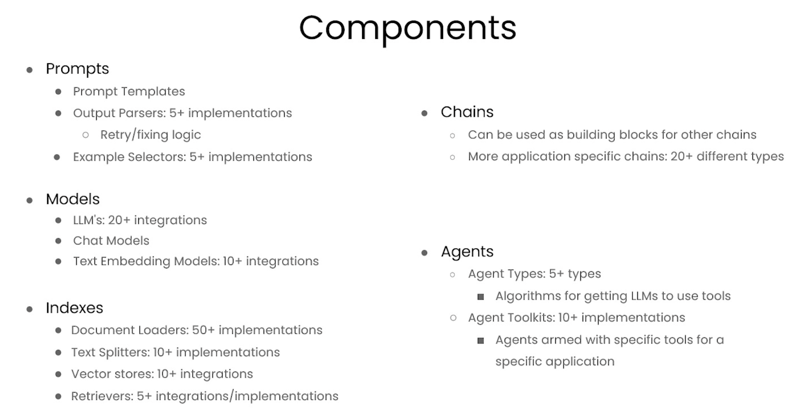
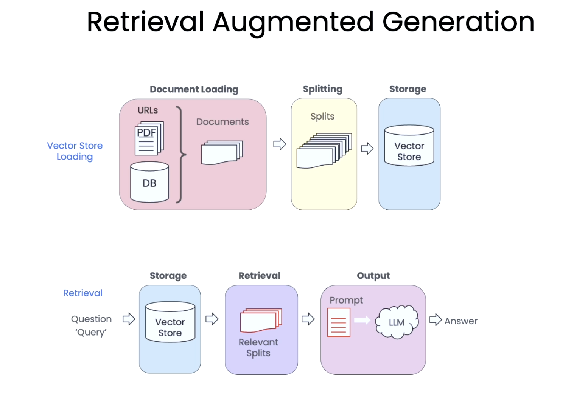

# LangChain Chat with Your Data

- https://learn.deeplearning.ai/courses/langchain-chat-with-your-data/l

Create a chatbot to interface with your private data and documents using LangChain.

- Learn from LangChain creator, Harrison Chase
- Utilize 80+ loaders for diverse data sources in LangChain
- Create a chatbot to interact with your own documents and data

